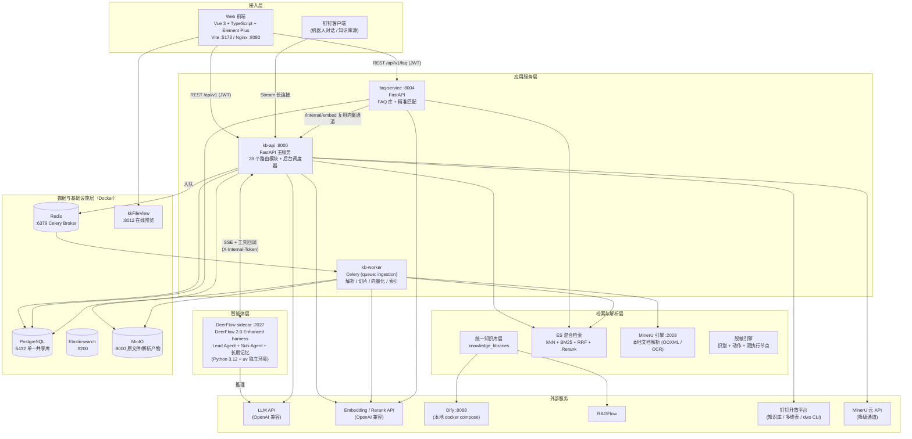
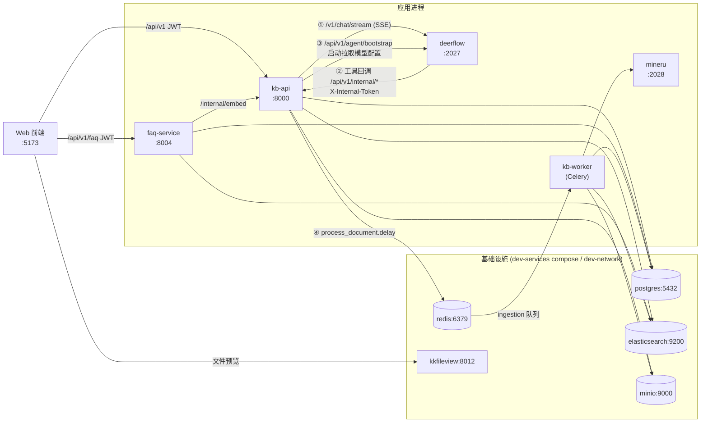
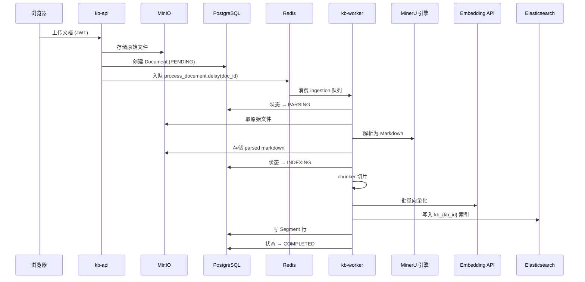
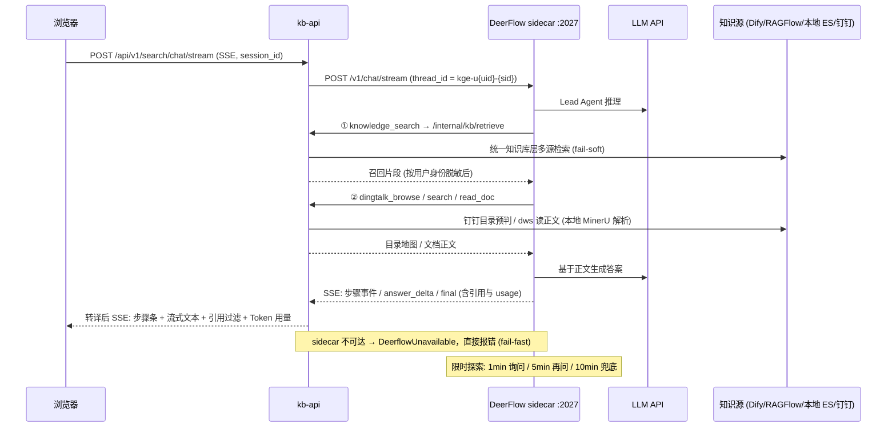
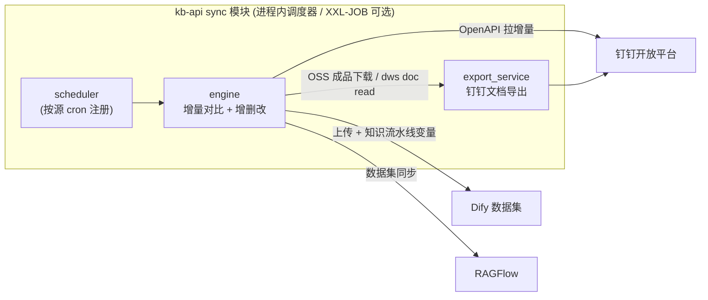
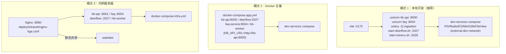

# 知识治理专家（KGE）系统架构说明

> 本文为系统架构的权威说明，基于代码实际实现梳理（2026-09）。运行部署方式见 [README](../README.md)。

## 1. 系统定位

知识治理专家（Knowledge Governance Expert）是面向企业知识全生命周期的治理平台，覆盖五大环节的闭环：

- **采集（汇得拢）**：钉钉知识库定时增量同步、本地文档上传、知识源管理
- **加工（读得懂）**：文档解析（MinerU）、知识打标、结构化处理、切片向量化
- **应用（用得上）**：智能问答（Agent）、FAQ 精准匹配、统一检索、脱敏策略
- **运营（看得见）**：运营看板、问答明细、Token 用量、召回/引用分析
- **治理（管得住）**：治理标准、知识缺口、知识 Owner、检索返回脱敏

技术形态：**微服务化的 Python 后端（FastAPI + Celery）+ Vue 3 前端 + Docker 基础设施 + 全外接模型 API**。

## 2. 架构总览（分层视图）



**架构要点**：

1. **4 应用进程 + 1 可选解析引擎 + 5 基础设施容器**：kb-api / faq-service / kb-worker / DeerFlow sidecar 四个应用进程，MinerU 本地引擎按需启动；基础设施全部容器化。
2. **模型全部外接**：Embedding / Rerank / LLM 均为 OpenAI 兼容 HTTP API，服务进程不加载本地模型。
3. **单一共享 PostgreSQL**：所有服务的 ORM 模型定义在 kb-common，共用一个库，schema 变更一律走 alembic 迁移。
4. **智能体以 sidecar 隔离**：DeerFlow harness 依赖 Python ≥3.12 / langgraph 1.x，与 kb-api 的 Python 3.11 环境不兼容，故独立进程运行，通过 HTTP + SSE 通信。

## 3. 进程与交互视图



**进程间通信方式汇总**：

| 调用方 → 被调方 | 协议 / 端点 | 认证 | 说明 |
|---|---|---|---|
| Web → kb-api | REST `/api/v1/*` | JWT Bearer | 全部业务功能 |
| Web → faq-service | REST `/api/v1/faq/*` | JWT Bearer | FAQ 库管理 |
| kb-api → DeerFlow | HTTP SSE `POST /v1/chat/stream` | 内网直连 | 问答主链路（fail-fast：sidecar 不可达直接报错，不回退旧链） |
| DeerFlow → kb-api | REST `/api/v1/internal/*`、`/api/v1/agent/bootstrap` | `X-Internal-Token`（env `KB_INTERNAL_TOKEN`） | knowledge_search / dingtalk_browse / dingtalk_search / dingtalk_read_doc 四个 Agent 工具 |
| faq-service → kb-api | REST `/internal/embed` | 服务间调用 | 复用外接 Embedding 通道 |
| kb-api → Redis | Celery broker | — | 文档入库任务入队 |
| kb-api ⇄ 钉钉 | Stream 长连接 + OpenAPI + dws CLI | AppKey/AppSecret | 机器人问答、知识库读取、文档正文 |

## 4. 组件职责

### 4.1 Web 前端（`web/`）

| 维度 | 内容 |
|---|---|
| 技术栈 | Vue 3.4（`<script setup lang="ts">`）+ TypeScript strict + Element Plus 2.x + Pinia + Vue Router 4 + Axios |
| 状态 | `stores/user.ts`（认证）、`stores/app.ts`（侧栏）、`stores/tabs.ts`（多标签页） |
| API 层 | `web/src/api/` 23 个模块，统一走 `request.ts`（JWT 注入、401 跳登录） |
| 功能区菜单 | 智能问答（内置 Agent / DEAP / HiAgent / Dify 三外链）、知识采集（知识源 / 钉钉同步 / 本地上传 / 同步队列）、知识加工（打标 / 解析引擎 / 结构化处理）、知识应用（脱敏策略 / 知识库）、知识运营、知识治理 |
| 配置菜单 | 智能体配置（模型 / 能力开关）、用户管理 |

### 4.2 kb-api（`services/kb-api/`，:8000）— 核心应用服务

**路由层（`app/routes/`，28 个模块）按领域分组**：

| 领域 | 路由模块 | 职责 |
|---|---|---|
| 认证与账户 | `auth` / `users` / `settings_route` | 登录 JWT、用户 CRUD、模型/系统运行时配置（DB 优先，.env 兜底） |
| 知识库核心 | `knowledge_base` / `directory` / `document` / `search` / `internal` | 文档库与目录树、上传、混合检索、`/internal/embed` 向量通道 |
| 统一知识库层 | `knowledge_library` / `knowledge_center` / `managed_library` | 登记 RAGFlow / Dify 镜像库、知识中心（钉钉 + 本地）、托管库 |
| 知识采集 | `sync_route` / `process_route` / `structured_route` | 钉钉→Dify/RAGFlow 同步任务、知识加工流水线、结构化处理 |
| 知识运营与治理 | `operate` / `governance` / `knowledge_gaps` / `metrics_route` | 运营看板（每日 0 点定时统计）、治理标准（钉钉多维表）、知识缺口 |
| 安全合规 | `sensitive` / `masking` | 敏感词典、脱敏策略/豁免/审计/沙箱 |
| 智能问答 | `qa_route` / `agent_route` / `agent_internal` / `chat_session_route` | 问答入口（SSE 转译）、智能体配置、sidecar 内部回调接口、会话持久化 |
| 外部引擎 | `dify_route` / `ragflow_route` / `mineru_route` | Dify / RAGFlow 代理转发、解析引擎管理 |

**服务层（`app/services/`）**：

| 模块 | 职责 |
|---|---|
| `agent/deerflow_runner.py` | DeerFlow 客户端：SSE 事件转译为前端协议、引用过滤（`_filter_cited_citations`）、取消透传；**sidecar 不可达 fail-fast（`DeerflowUnavailable`）** |
| `agent/config.py` / `agent/llm.py` | 智能体配置、LLM 解析 |
| `sync/` | 钉钉→Dify/RAGFlow 增量同步引擎：`engine`（同步逻辑）、`scheduler`（cron 调度，XXL-JOB 可选）、`worker`、`export_service`（钉钉文档导出） |
| `knowledge_engines/` | `local_chunker`（本地切片）、`mineru`（解析引擎）、`ragflow`（RAGFlow 通道） |
| `masking.py` | 脱敏引擎：内置正则 + 敏感词典 + 上下文规则识别，六类动作，多策略取最严格，一致性替换 |
| `chat.py` | 问答会话逻辑 |
| `dingtalk_bot.py` | 钉钉机器人 Stream 长连接（lifespan 内启动/停止） |
| `processing.py` / `structured_engine.py` / `ingestion.py` / `llm_resolver.py` / `collection_history.py` / `dingtalk_identity.py` | 知识加工、结构化引擎、入库编排、LLM 多配置解析、采集历史、钉钉身份 |

**后台任务（lifespan 启动，[main.py](../services/kb-api/app/main.py)）**：
1. 从 DB `settings` 表加载运行时配置覆盖环境变量（LLM / Dify / RAGFlow / 钉钉等 11 个键）
2. 数据库连接池两段式预热（启动阶段 ≤8s + 后台补齐）
3. 旧版单值配置 → LLM/Dify profiles 表一次性迁移
4. 运营看板每日 0 点统计调度器
5. 钉钉→Dify 定时增量同步调度器（按源 cron 注册）
6. 钉钉机器人 Stream 长连接（凭证齐全才启动）

### 4.3 DeerFlow sidecar（`services/deerflow/`，:2027）— 智能问答 Agent 底座

| 维度 | 内容 |
|---|---|
| 形态 | vendor 的 DeerFlow 2.0 Enhanced harness，FastAPI + SSE（入口 `app/qa_server.py`），Python 3.12 + uv 独立环境 |
| 运行方式 | 进程内嵌入式 `DeerFlowClient` 直跑 Lead Agent（create_agent 中间件链 + Sub-Agent 并行调研 + 长期记忆 + 摘要压缩 + sqlite 检查点），无需 langgraph server |
| 配置自举 | 启动时 `GET kb-api /api/v1/agent/bootstrap` 拉取模型配置，生成 `config.yaml` 与 `SOUL.md` 人格；kb-api 晚启动时后台重试（40 次 × 5s） |
| Agent 工具（`extensions/kb_tools.py`） | `knowledge_search`（统一知识库层多源检索）、`dingtalk_browse`（目录地图预判/列目录，在线文档优先）、`dingtalk_search`（文件名缓存补漏）、`dingtalk_read_doc`（dws CLI 读正文，二进制文件优先本地 MinerU 解析） |
| 检索策略（SOUL.md/SKILL.md 规定） | 先预判目录再进目录；知识类问题主动同时双源检索；每读完一篇即判断能否作答；钉钉命中文档必须读正文；3-5 次关键词穷尽检索 |
| 并发与取消 | 专属 worker 线程 + asyncio.Queue 泵驱动同步 `agent.stream()`；sqlite 检查点方法级 RLock 支持多会话并行（前端最多 5 路）；`/v1/chat/cancel` 确定性停止 |
| 限时探索 | 1 分钟询问 / 5 分钟再问 / 10 分钟兜底（`ExplorationTimeoutMiddleware`，阈值可用 `KGE_EXPLORE_*` 覆盖） |

### 4.4 faq-service（`services/faq-service/`，:8004）

独立 FastAPI 进程，路由 `kb / directory / entry / search`：FAQ 库 CRUD、FAQ 目录树、Q&A 条目管理、CSV/Excel 批量导入、精确 + 语义融合检索。与 kb-api 共享 PostgreSQL 与 kb-common；Embedding 经 kb-api `/internal/embed` 复用外接通道。

### 4.5 kb-worker（`app/worker.py`，Celery queue `ingestion`）

文档入库异步流水线，消费 Redis `ingestion` 队列，任务 `process_document`：

```
PENDING → PARSING（MinerU 解析，markdown 存 MinIO）→ INDEXING（chunk + embed + ES 索引）→ COMPLETED / FAILED
```

### 4.6 MinerU 本地引擎（`services/mineru/`，:2028，可选）

自托管 MinerU 3.x `mineru-api`（`scripts/start-mineru.sh` 自动 uv 安装）。Office（pptx/docx/xlsx）走原生 OOXML 转换（秒级、无需模型）；PDF/扫描件走 pipeline（OCR/版面/表格）。被 `dingtalk_read_doc`（Agent 读钉钉文档）与 kb-worker（本地文档入库）复用；不可用时逐级降级：本地引擎 → python-pptx/docx/openpyxl/pdfplumber 即时解析 → MinerU 云 API。

### 4.7 共享包 kb-common（`services/kb-common/kb_common/`）

| 模块 | 内容 |
|---|---|
| `models.py` | 全部 SQLAlchemy ORM（单库共享）：`User` `ApiKey` `KnowledgeBase` `Directory` `Document` `Segment` `FaqDirectory` `FaqEntry` `Setting` 及治理域表（`masking_*` 等） |
| `database.py` | AsyncSession 工厂、连接池预热 |
| `config.py` | Pydantic Settings（.env） |
| `security.py` | JWT 签发/校验、API Key 哈希、RBAC |
| `rag/` | `embedder`（外接向量 API）、`chunker`、`indexer`（ES 写入）、`searcher`（kNN+BM25+RRF 混合检索）、`reranker`（外接重排，未配置自动跳过）、`tracer`（检索溯源） |
| `clients/` | `minio_client` `es_client` `mineru_client` `llm_client` `dify_client` `dify_document` `ragflow_client` `dingtalk_client` `document_upload` `source_integrity` |

## 5. 关键链路

### 5.1 文档入库流水线



### 5.2 智能问答链路（SSE + 工具回调）



链路关键设计：

- **事件转译**：DeerFlow 原生事件由 `deerflow_runner` 转为前端协议（🦌 智能体 / 📚 知识检索 / 📌 钉钉检索 / 📖 读文档 / 🙋 等待确认 + `answer_delta` + `final`）；过渡独白与规划段落按消息 id 缓冲过滤，输出直接是答案正文。
- **引用过滤**：`final` 前按答案正文过滤引用（只保留答案实际提及的文档），同时携带全量召回快照（`cited` 标记），供「知识运营 → 问答明细」展示召回/引用分析。
- **脱敏双节点**：送 LLM 前——`/internal/kb/retrieve` 出口按 `thread_id` 回溯提问者身份后对片段脱敏（reject 整条丢弃）；输出后——统一检索与问答流式输出二次扫描。
- **多轮记忆**：同一会话复用 sqlite 检查点（`thread_id` 映射）；会话持久化到 kb-api `chat_messages`。
- **可中断**：前端停止按钮双保险（abort SSE + `POST /api/v1/search/chat/cancel` → sidecar `/v1/chat/cancel`），中间件在模型节点边界确定性短路，不空耗 token。

### 5.3 钉钉知识 → Dify/RAGFlow 增量同步



同步任务记录、目录快照（`dingtalk_folder_stats`）、失败重试均在共享 PG 中管理；「同步队列」页可视化跟踪。

### 5.4 配置体系

```
运行时配置优先级：DB settings 表（加密存储，模型配置页维护，含连通性测试）
                → .env（Pydantic Settings 兜底）
kb-api 启动时将 DB 配置覆盖到 os.environ；DeerFlow sidecar 启动时经 bootstrap 接口自举。
敏感信息（API Key / AppSecret）UI 脱敏展示（••••••••）、DB 加密存储。
```

## 6. 数据架构

### 6.1 存储分工

| 存储 | 职责 | 关键布局 |
|---|---|---|
| PostgreSQL | 唯一业务事实源（单库共享） | 用户/权限、知识库元数据、目录树、文档/切片记录、FAQ、同步任务、治理与脱敏表、settings |
| Elasticsearch | 检索引擎 | 索引命名 `kb_{kb_id}`（文档库）/ `faq_{kb_id}`（FAQ 库）；kNN + BM25 混合，RRF 融合后外接重排 |
| MinIO | 对象存储 | 原始文件 + MinerU 解析后 markdown |
| Redis | 消息队列 | Celery broker（`ingestion` 队列） |
| sqlite（sidecar 内） | Agent 检查点 | 多轮记忆与断点续跑（`thread_id` 隔离） |

### 6.2 核心数据模型（`kb_common/models.py`）

```
users ──► knowledge_bases (kb_type: DOCUMENT | FAQ)
              ├──► directories (树) ──► documents ──► segments (↔ ES 文档)
              └──► faq_directories (树) ──► faq_entries ──► segments

api_keys ──► users                    # 开放 API（哈希存储）
settings                              # 运行时配置覆盖 + profiles（LLM/Dify 多配置）
knowledge_libraries                   # 统一知识库层：RAGFlow / Dify 镜像库登记
masking_policies / masking_exemptions / masking_logs   # 脱敏策略域
sensitive_items                       # 敏感词典
dingtalk_folder_stats                 # 钉钉目录快照（治理/采集复用）
```

**schema 纪律**：所有变更走 alembic 迁移（现有 35 个版本），先 `alembic heads` 确认无并行冲突；禁止 create_all / 手工改表；部署时 `alembic upgrade head` 并验证受影响接口。

## 7. 认证与安全

| 通道 | 机制 |
|---|---|
| Web → 后端 | JWT Bearer（`request.ts` 拦截器注入，401 跳登录） |
| 开放 API | API Key（哈希存储，RBAC 辅助） |
| sidecar → kb-api 内部接口 | `X-Internal-Token`（env `KB_INTERNAL_TOKEN`，重启 sidecar 必须用 `scripts/start-deerflow.sh` 以保留环境变量） |
| 敏感配置 | UI 脱敏展示 + DB 加密存储 |
| 检索返回脱敏 | 条件（作用域继承叠加/角色/场景）→ 识别（正则/词典/上下文）→ 动作（遮蔽/泛化/替换/哈希/截断/拒绝，多策略取最严格）→ 双执行节点（送 LLM 前 + 输出后）→ 兜底 → 审计（不含敏感原文） |

## 8. 部署拓扑

三种模式，应用代码与镜像完全一致：



- 模式 1/2 共用外部 `dev-network`；基础设施 compose 独立于应用 compose，`depends_on` 不跨 compose 使用。
- 模式 3 仅放行前端 8080（ufw），kb-api 内网端口 8001；前端产物本地 `pnpm build` 后上传，nginx 反代 `/api/v1/faq → 8004`、`/api/v1 → 8001`。
- XXL-JOB（`deploy/xxl-job/`）为同步任务的可选外部调度器，未启用时回退进程内调度。

## 9. 技术选型清单

| 层 | 技术 | 版本/说明 |
|---|---|---|
| 前端 | Vue 3 + TypeScript + Element Plus + Pinia + Vite + Vitest | strict 模式，中文界面 |
| Web 服务 | FastAPI + Uvicorn | kb-api / faq-service / sidecar |
| 异步任务 | Celery（Redis broker） | `ingestion` 单队列 |
| ORM / 迁移 | SQLAlchemy 2.x (async) + Alembic | 单库共享，35+ 迁移 |
| 关系库 | PostgreSQL | 单一共享库 |
| 检索 | Elasticsearch | kNN + BM25 + RRF + 外接 Rerank |
| 对象存储 | MinIO | 原文件 + 解析产物 |
| 预览 | kkFileView | 浏览器直连 |
| Agent 底座 | DeerFlow 2.0 Enhanced（vendor） | Python 3.12 + langgraph 1.x，sidecar 隔离 |
| 文档解析 | MinerU 3.x（本地自托管 + 云 API 降级） | :2028 |
| 模型接入 | OpenAI 兼容 HTTP API | LLM / Embedding / Rerank 全外接 |
| 外部知识引擎 | Dify（本地 compose :8088）/ RAGFlow | 统一知识库层多通道 |
| 钉钉集成 | OpenAPI + Stream 长连接 + dws CLI | 知识库 / 多维表 / 机器人 |

## 10. 关键架构决策（ADR 摘要）

| # | 决策 | 动机与权衡 |
|---|---|---|
| 1 | **模型全部外接**（Embedding/Rerank/LLM 走 HTTP API） | 消除本地模型加载的内存/启动开销；多服务经 `/internal/embed` 统一通道，避免 API Key 多处配置；代价是强依赖外部 API 可用性 |
| 2 | **DeerFlow 以独立 sidecar 运行**（:2027） | harness 要求 Python ≥3.12 / langgraph 1.x，与 kb-api（3.11 / langchain 0.x）无法同环境；进程隔离 + HTTP/SSE 通信，代价是部署多一个进程与内部 token 管理 |
| 3 | **sidecar fail-fast，无旧链回退** | `DeerflowUnavailable` 直接报错提示启动 sidecar；避免维护双问答链路的质量分叉（早期内置 LangGraph 工作流已移除） |
| 4 | **单一共享 PostgreSQL + kb-common 共享包** | MVP 阶段最小化运维复杂度；跨服务数据一致性与迁移统一（alembic）；代价是服务间无存储隔离，扩容需整库扩 |
| 5 | **FAQ 独立进程、共享库与向量通道** | FAQ 高频精准匹配与文档 RAG 演进节奏不同；仅拆进程不拆存储，保持简单 |
| 6 | **ES 混合检索 + RRF + 可选重排** | kNN 语义与 BM25 关键词互补；Rerank 未配置时自动跳过，保证降级可用 |
| 7 | **配置 DB 优先、.env 兜底** | 运行时可改（模型配置页 + 连通性测试），重启不丢；启动 lifespan 覆盖 env，全服务口径一致 |
| 8 | **统一知识库层（knowledge_libraries）** | Dify / RAGFlow / 本地 ES 多源以镜像库登记统一管理，检索按 platform 分通道、fail-soft 降级（坏库跳过、引擎异常转 warnings） |
| 9 | **文档解析三级降级** | 本地 MinerU（秒级 OOXML / OCR pipeline）→ python 库即时解析 → MinerU 云 API；保障弱网/无 Key 场景可用 |
| 10 | **多会话并行 + 确定性取消** | sqlite 检查点方法级 RLock 替代全局锁；取消走 `gen.close()` + 模型节点边界短路，不空耗 token |
