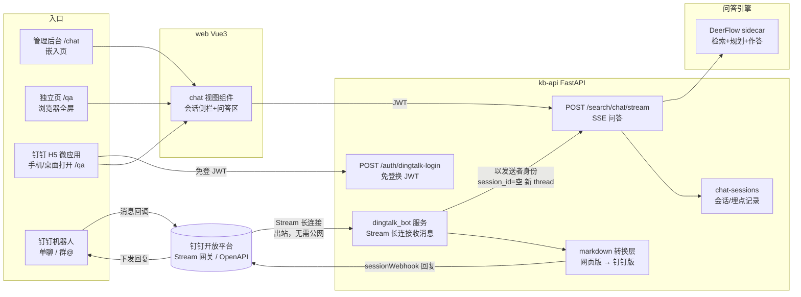
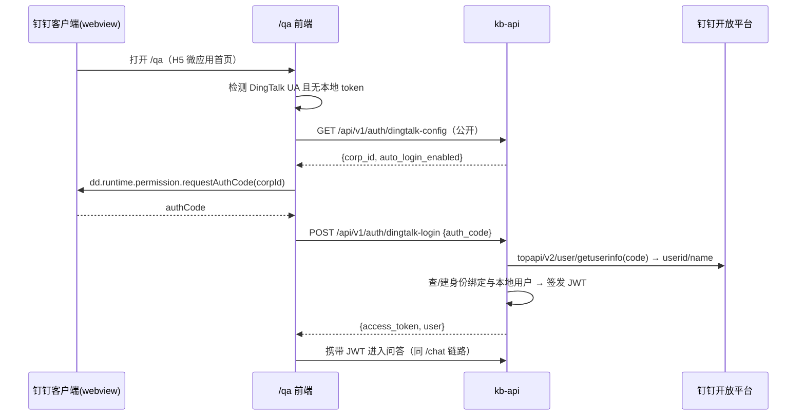
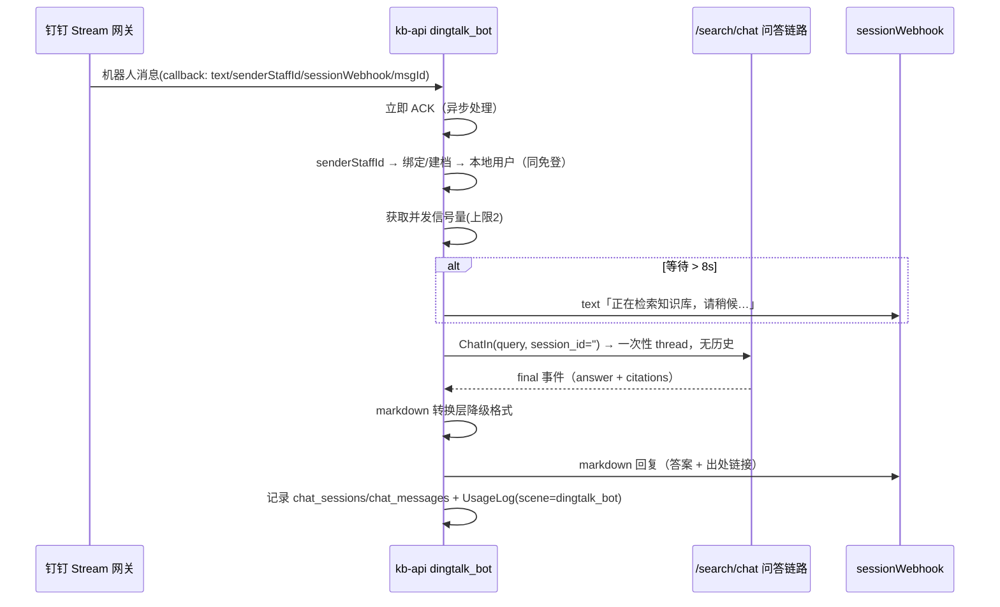

# 智能问答独立页 & 钉钉接入（H5 微应用 + 机器人）设计方案

- 日期：2026-09-12
- 状态：待确认
- 关联模块：web（Vue 3）、kb-api（FastAPI）、DeerFlow sidecar、钉钉开放平台

## 0. 背景与目标

当前智能问答嵌在管理后台布局内（`/chat`，左侧导航 + 页签占据大量空间），问答窗口小；且问答能力只能在管理后台内使用，钉钉侧（手机/桌面）无法触达。

本方案交付三个能力：

1. **独立问答页**：全屏单页打开智能问答（含会话历史），管理后台内一键新窗口打开。
2. **独立访问地址 + 钉钉应用接入**：提供独立 URL，配置为钉钉 H5 微应用；钉钉内打开自动免登，浏览器打开走原有账号登录。
3. **钉钉机器人问答**：企业内部机器人接收单聊 / 群 @ 消息，调用同一条问答链路回答；**钉钉侧问答不带会话历史**（每问独立）。

设计原则：三个入口复用同一条问答链路（`/api/v1/search/chat/stream` → DeerFlow sidecar），不新建问答引擎；身份、配置、运营埋点统一进现有体系。

## 1. 总体架构



关键点：

- **机器人不走 SSE/HTTP 回调**：采用钉钉 **Stream 模式**（kb-api 进程内向钉钉网关建立出站 WebSocket 长连接），内网服务器（10.10.166.2）无需公网 IP、无需开 nginx 入口。
- **无历史问答 = 空 session_id**：现有 `_prepare_qa` 在 `session_id` 为空时已生成一次性 `thread_id`（`anon-{user}-{uuid}`），机器人直接复用该路径，天然无上下文。
- **钉钉凭证复用**：settings 表已有 `dingtalk_app_key / dingtalk_app_secret / dingtalk_robot_code`（系统配置页「钉钉」卡片），本方案在其上追加 corpId 与机器人开关，不新建凭证体系。

## 2. 功能一：独立问答页（/qa）

### 用户故事

- 作为知识使用者，我希望在独立浏览器标签全屏问答，以便获得更大的阅读与输入空间。
- 作为管理员，我希望从后台问答页一键新开独立窗口，以便投屏/演示时不被后台导航干扰。

### 方案

- 新增**顶层路由 `/qa`**（不在 AppLayout 子路由内），复用现有 `views/chat/index.vue` 组件（会话侧栏 + 问答区 + 输入栏整体复用，零重写）：
  - 路由 `meta.standalone = true`，视图内据此切换根容器高度为 `100dvh`、渲染一条极简顶栏（智能体名称 + 「返回管理后台」链接，仅登录态显示）。
  - 嵌入页 `/chat` 头部增加「新窗口打开」图标按钮：`window.open('/qa')`。
- 鉴权与 `/chat` 完全一致（JWT guard）；浏览器无 token 时跳 `/login?redirect=/qa`，登录后回跳。
- 移动端（<768px）会话侧栏收为抽屉（el-drawer），保证手机钉钉内可用（见功能二）。

### 功能需求（FR）

| 编号 | 需求 | 优先级 |
|---|---|---|
| FR1-1 | `/qa` 全屏渲染问答组件（会话历史 + 问答区 + 输入栏），高度自适应视口 | P0 |
| FR1-2 | `/chat` 页提供「新窗口打开」入口 | P0 |
| FR1-3 | 独立页顶栏含返回后台入口；未登录跳登录并回跳 `/qa` | P0 |
| FR1-4 | 移动端会话侧栏抽屉化、输入栏安全区适配 | P1 |

### 验收标准

- Given 已登录用户在 `/chat`，When 点击「新窗口打开」，Then 新标签打开 `/qa`，问答区占满视口且会话历史与后台页一致（同一会话数据）。
- Given 未登录浏览器访问 `/qa`，When 提交登录，Then 回跳 `/qa` 并保留原意图（不丢 query 参数）。
- Given 手机宽度（375px）打开 `/qa`，When 点击会话历史按钮，Then 侧栏以抽屉展开，问答区不被挤压换行。

## 3. 功能二：独立访问地址 + 钉钉 H5 微应用接入

### 用户故事

- 作为员工，我希望在钉钉工作台/会话里直接点开问答页且无需输入账号密码，以便随手提问。
- 作为管理员，我希望有一个固定访问地址可分发、可配置进钉钉应用，以便统一入口。

### 访问地址

- 独立地址即部署域名下的 `/qa`（内网部署：`http://10.10.166.2:<port>/qa`；如后续挂域名则同路径）。
- 钉钉开放平台将同一地址配置为 **H5 微应用首页**（见 3.4 配置清单）。

### 免登时序



### 身份映射与自动建档

- 新增表 `dingtalk_bindings`（alembic 迁移，遵循仓库迁移规范）：

```sql
CREATE TABLE dingtalk_bindings (
  id UUID PRIMARY KEY DEFAULT gen_random_uuid(),
  user_id UUID NOT NULL REFERENCES users(id) ON DELETE CASCADE,
  corp_id VARCHAR(64) NOT NULL,
  dt_userid VARCHAR(128) NOT NULL,
  dt_unionid VARCHAR(128),
  dt_name VARCHAR(100),
  created_at TIMESTAMP NOT NULL DEFAULT now(),
  UNIQUE (corp_id, dt_userid)
);
```

- 首次免登自动建档：`users.username = dd_{dt_userid}`（稳定唯一，不可密码登录，随机密码哈希）、`role = viewer`（仅问答可见，无管理权限）、绑定表记录真实姓名供展示与运营归因。
- 已存在绑定则直接复用本地用户；钉钉改名时更新 `dt_name`（username 不改，保证主键语义稳定）。

### 接口定义

```jsonc
// GET /api/v1/auth/dingtalk-config  （公开，免登前置）
{ "corp_id": "dingb832549ed9dd356e", "auto_login_enabled": true }

// POST /api/v1/auth/dingtalk-login
// req:  { "auth_code": "xxxx" }
// resp: 与 /auth/login 同构
{ "access_token": "eyJ...", "token_type": "bearer",
  "user": { "id": "...", "username": "dd_0330...", "role": "viewer", "display_name": "黄景新" } }
```

- 免登失败（authCode 无效/应用未授权该用户）返回 401 + 明确文案，前端回退展示账号登录表单（fail fast，不静默）。
- 非钉钉环境（普通浏览器）不触发免登，直接走登录页。

### 3.4 钉钉开放平台配置清单（人工操作，一次性）

1. 复用已配置知识源所用的企业内部应用（已有 AppKey/AppSecret），为其追加能力：**机器人** + **H5 微应用**（避免新建应用与第二套凭证）。
2. 机器人消息接收模式选择 **Stream 模式**。
3. H5 微应用首页地址填 `http://10.10.166.2:<port>/qa`；应用可见范围设为全员（或目标部门）。
4. 权限点确认：通讯录个人信息读权限（免登 getuserinfo）、企业内机器人发送消息权限（已有）、知识库读权限（已有）。
5. 系统配置页填写新增项 `dingtalk_corp_id`、开启机器人开关（见 §5）。

### 验收标准

- Given 员工在钉钉工作台点击应用，When 页面加载完成，Then 无需输入账号即进入问答页，顶栏显示其钉钉姓名。
- Given 同一员工首次免登，When 后台查看用户管理，Then 存在 `dd_{userid}` 用户（role=viewer）及绑定记录；二次免登不重复建档。
- Given 普通 Chrome 打开 `/qa` 且未登录，When 页面加载，Then 展示登录表单而非免登报错。

## 4. 功能三：钉钉机器人问答

### 用户故事

- 作为员工，我希望在钉钉单聊或群里 @ 机器人提问并直接得到带出处的答案，以便不离开钉钉完成查询。
- 作为运营者，我希望机器人问答同样进入问答明细/调用日志，以便统一统计问答准确率（北极星指标）。

### 消息接收：Stream 长连接

- kb-api 进程内新增 `app/services/dingtalk_bot.py`：lifespan 启动时若 `dingtalk_bot_enabled=true` 且凭证齐全，用 `dingtalk-stream` SDK 建立出站长连接并注册 ChatbotHandler；进程退出时断开。未配置则不启动（fail fast：配置页状态显示「未启用」，不报错不假跑）。
- 单聊与群 @ 消息均接收；群内仅响应 @ 机器人的消息（钉钉网关语义）。
- 断线由 SDK 自动重连；状态接口暴露 connected / last_error 供配置页展示。

### 处理时序



### 无历史语义（用户明确要求）

- 每条消息 `session_id=''` → 一次性 thread_id，不携带任何上文；不读取也不写入记忆文档。
- **运营记录与上下文分离**：为每位钉钉用户维护一个固定会话（标题「钉钉机器人·{姓名}」），仅用于问答明细/反馈统计落库，**不参与**问答上下文组装。

### 回复格式转换层（网页 markdown → 钉钉 markdown）

钉钉 sampleMarkdown 不支持表格与稳定代码块，转换规则：

| 网页元素 | 钉钉处理 |
|---|---|
| 表格 | 逐行转列表：`- 表头2: 单元格2（单元格3…）`，首列表头作为行首标签 |
| 代码块 ``` | 去围栏保留文本（缩进展示），不保证等宽 |
| 标题 #~### | 保留（钉钉支持 1-6 级标题） |
| 加粗/斜体/列表/引用/链接 | 原样保留 |
| 图片 | 公网不可达的内网图链剔除，替换为「〔图：alt〕」占位 |
| 超长答案 | 截断至 4500 字符并附「…全文见知识治理平台 /qa」 |

示例：

```text
网页版：                          钉钉版：
| 判定维度 | 特大事故标准 |        **特大事故判定标准**
|---|---|                        - 判定维度→内外部损失金额: 100万元及以上
| 内外部损失金额 | 100万元及以上 |  - 判定维度→投诉次数: 平缝≥100次、包缝≥30次…
| 投诉次数 | 平缝≥100次… |        依据：《杰克质量事故问责管理制度》4.1.4 [1]
```

### 回复通道与并发

- 回复走回调自带 `sessionWebhook`（单聊/群聊通用，POST `{msgtype:"markdown", markdown:{title,text}}`）；webhook 失效时降级 OpenAPI：单聊 `robot/oToMessages/send`（已有 `send_text_message`，补 markdown 版），群聊 `robot/groupMessages/send`。
- 并发信号量 **2**（与 LiteLLM 网关实测并发上限对齐）；超出排队，等待 >8s 发排队提示，避免静默。
- 同一用户 5s 内重复消息去重（msgId 幂等 + 文本去抖），防止钉钉重试导致双答。

### 失败兜底（fail fast，不假数据）

| 场景 | 回复文案 |
|---|---|
| LLM 未配置 | 「问答模型未配置，请联系管理员在知识治理平台·系统配置中设置。」 |
| DeerFlow sidecar 未就绪 | 「问答服务未就绪（sidecar 未启动），请稍后重试或联系管理员。」 |
| 检索超时(300s) | 复用网页版超时话术 |
| 钉钉凭证缺失/Stream 未连接 | 不启动机器人；配置页显示「未启用/未连接」及原因 |

### 验收标准

- Given 员工单聊机器人发送「特大质量事故的判定标准是什么」，When 处理完成，Then 收到 markdown 答案且含制度名称与出处编号，表格已转列表无乱码。
- Given 群内 @ 机器人提问，When 答案生成，Then 仅该群收到回复，且提问人身份归因到其本地用户（问答明细可见）。
- Given 连续两条无关联提问，When 第二条含代词「它的流程呢」，Then 机器人按独立问题检索回答（不继承上文，允许答非所问并提示补充完整问题）。
- Given 系统配置关闭机器人开关并重启 kb-api，When 查看配置页状态，Then 显示「未启用」，钉钉发消息无回复且无报错日志刷屏。

## 5. 配置与数据模型变更

### settings 新增键（系统配置页「钉钉」卡片扩展）

| key | 说明 | 示例 |
|---|---|---|
| `dingtalk_corp_id` | 企业 corpId（免登 requestAuthCode 用） | `dingb832549ed9dd356e` |
| `dingtalk_bot_enabled` | 机器人 Stream 开关 | `true` / `false` |
| `dingtalk_bot_allow_users` | 可选白名单（dt_userid 逗号分隔；空=全员） | `` |

复用既有：`dingtalk_app_key`、`dingtalk_app_secret`、`dingtalk_robot_code`、`dingtalk_operator_union_id`。

配置页新增展示：机器人运行状态（未启用/连接中/已连接/最近错误）、免登开关状态；保存后机器人热启停（不重启服务）。

### 数据模型

- 新表 `dingtalk_bindings`（DDL 见 §3），alembic 迁移一个版本；`users` 表零改动。
- `chat_sessions/chat_messages` 零改动（机器人记录复用现有结构，session 标题前缀区分来源）。

### 依赖新增

- kb-api：`dingtalk-stream`（机器人 Stream SDK）。
- web：`dingtalk-jsapi`（免登 requestAuthCode）。

## 6. 非功能需求（NFR）

| 编号 | 需求 |
|---|---|
| NFR-1 | 机器人端到端 P90 回复时间 ≤ 90s（含检索+作答）；超时按兜底话术回复 |
| NFR-2 | 机器人并发问答 ≤2（网关保护），排队有可见反馈 |
| NFR-3 | Stream 断线 30s 内自动重连；kb-api 重启后机器人自恢复 |
| NFR-4 | 免登 JWT 与后台 JWT 同密钥同过期策略；绑定表不存任何 secret |
| NFR-5 | 机器人问答全量落 UsageLog + 问答明细，来源可区分（scene=dingtalk_bot） |
| NFR-6 | 独立页首屏不加载后台布局资源（顶层路由懒加载） |

## 7. 实施计划

**迭代 1（P0，约 3-4 人日）**
1. 后端：`dingtalk_bindings` 迁移 + 免登接口（`/auth/dingtalk-config`、`/auth/dingtalk-login`）+ dingtalk_client 补 getuserinfo。
2. 前端：`/qa` 顶层路由 + standalone 适配 + 「新窗口打开」按钮 + 免登前置逻辑 + 移动端抽屉。
3. 后端：`dingtalk_bot.py`（Stream 接收、无历史问答调用、markdown 转换、sessionWebhook 回复、埋点）+ 配置页状态卡片 + 热启停。
4. 自测：playwright 截图独立页桌面/移动两态；机器人单聊/群 @ 实测；免登需真机钉钉验证。

**迭代 2（P1，约 1-2 人日）**
5. 群聊出处链接深跳 H5、答案点赞/点踩指令（回复「赞/踩」记反馈）。
6. 机器人回复升级钉钉 AI 互动卡片（流式打字机效果），替换 markdown 消息。

## 8. 风险与边界

- **钉钉 markdown 能力有限**：表格/代码块降级展示，复杂答案可读性弱于网页版；卡片化（迭代 2）缓解。
- **内网可达性**：H5 微应用要求手机与服务器同网（办公 Wi-Fi/VPN）；机器人 Stream 为出站连接不受影响。
- **LiteLLM 网关并发≈2**：机器人信号量已对齐；网页+机器人同时高并发仍可能排队，属网关额度问题（治本在网关侧）。
- **问答明细既有口径**：`qa_route.qa_details` 现有过滤 `u.role='user'` 与当前角色枚举（super_admin/admin/editor/viewer）不匹配，钉钉/自动建档用户问答默认不会出现在明细中——建议本迭代顺带修正为「排除管理类角色」，见确认点 2。
- **sessionWebhook 有效期约 1 小时**：单轮回复足够；超时降级 OpenAPI 已覆盖。

## 9. 确认点（请拍板）

1. **应用复用**：在已配置知识源的现有钉钉应用上追加「机器人 + H5 微应用」能力（推荐，免第二套凭证）；还是新建独立应用？
2. **问答明细口径**：是否本迭代顺带修正 `u.role='user'` 过滤，使钉钉问答进入运营明细（推荐修正）？
3. **回复形态**：MVP 用 markdown 消息（推荐），AI 互动卡片流式效果放迭代 2；是否同意？
